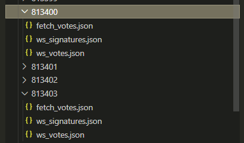
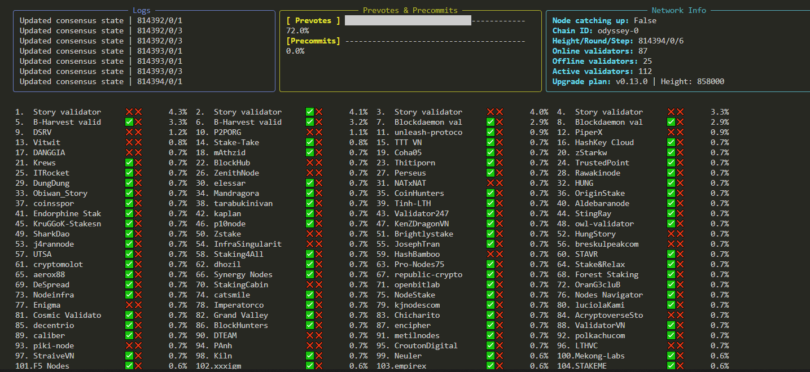

### 1. Update and install required packages
```bash
sudo apt update && sudo apt install python3 python3-venv git -y
```
### 2. Clone the repository
```bash
git clone https://github.com/trusted-point/Story-Consensus-Metrics.git
```
### 3. Activate virtual environment
```bash
cd Story-Consensus-Metrics
python3 -m venv venv
source venv/bin/activate
```
### 4. Install dependencies
```bash
pip3 install -r requirements.txt
```
### 5. Print help info
```bash
python3 main.py --help
```
### Falgs and params
```bash
  -h, --help            show this help message and exit
  --log_lvl LOG_LVL     Set the logging level [DEBUG, INFO, WARNING, ERROR] (default: INFO)
  --log_path LOG_PATH   Path to the log file (default: logs/logs.log)
  --log_save            To save logs (default: True)
  --rpc RPC             RPC server http/s (default: None)
  --ws WS               Websocket endpoint (default: None)
  --target_height TARGET_HEIGHT
                        Block height to snapshot consensus prevotes & precommits (default: None)
  --post_target_check_blocks_num POST_TARGET_CHECK_BLOCKS_NUM
                        How many blocks to keep snapshoting consensus prevotes & precommits after target_height is reached (default: 10)
  --save_all            Save all validators metrics for all blocks (signatures, prevotes, precommits etc.). Making target_height argument useless (default: False)
  --no_save             Do not save any metrics (signatures, prevotes, precommits etc.) (default: False)
  --dashboard_only      To open real-time consensus dashoard. No data will be saved no matter what flags and args you set (default: False)
  --dashboard_disable_emojis DASHBOARD_DISABLE_EMOJIS
                        To disable emojis in dashboard output (use in case emojis break the table) (default: False)
  --dashboard_refresh_per_second DASHBOARD_REFRESH_PER_SECOND
                        Refresh rate of the table (default: 1)
```
### Usage
- The script will connect to cosmos websocket, process consensus events and save them to result/<height>/ws_votes.json 
- The script will connect to cosmos websocket, process new produced blocks and save them to result/<height>/ws_signatures.json 
- The script will start fetching consensus state from /consensus_state endpoint non-stop, process and save data to result/<height>/fetch_votes.json

[]()


```bash
python3 main.py --rpc https://story-testnet-cosmos-rpc.crouton.digital --ws wss://story-testnet-cosmos-ws.crouton.digital/websocket --log_lvl debug --save_all
```
```
[2024-11-25 11:42:29] |   DEBUG   | Saved Precommit   Stake-Take  | Round: 0   | Height: 814165
[2024-11-25 11:42:29] |   DEBUG   | Saving Precommit  Nodes Navig | Round: 0   | Height: 814165
[2024-11-25 11:42:29] |   DEBUG   | Loaded result/814165/ws_votes.json state
[2024-11-25 11:42:29] |   DEBUG   | Saved Precommit   Nodes Navig | Round: 0   | Height: 814165
[2024-11-25 11:42:29] |   INFO    | Finalized #814164  | Signatures: 112  / 112  | Proposer: 74BFA68B891675E1F8613517D50BD63672CED6EA | Missing signatures: []
[2024-11-25 11:42:29] |   DEBUG   | Saved #814164 signatures
[2024-11-25 11:42:29] |   DEBUG   | Saving Precommit  KruGGoK-Sta | Round: 0   | Height: 814165
[2024-11-25 11:42:29] |   DEBUG   | Loaded result/814165/ws_votes.json state
[2024-11-25 11:42:29] |   DEBUG   | Saved Precommit   KruGGoK-Sta | Round: 0   | Height: 814165
```
If you don't need to save all blocks data and save only specific height metrics:
- remove --save_all flag
- specify --target_height. The script won't save any metrics from other blocks except this one.
- specify --post_target_check_blocks_num (default: 10) if target_height is provided. The script will save signatures, consensus rounds, validators prevotes and precommits for 10 post target blocks

Open real-time consensus monitroing dashoard. In dashboard mode no metrics will be saved no matter what other flags and args you set
```bash
python3 main.py --rpc https://story-testnet-cosmos-rpc.crouton.digital --ws wss://story-testnet-cosmos-ws.crouton.digital/websocket --dashboard_only
```
- If your table is broken try to disable emojis with `--dashboard_disable_emojis`
[]()